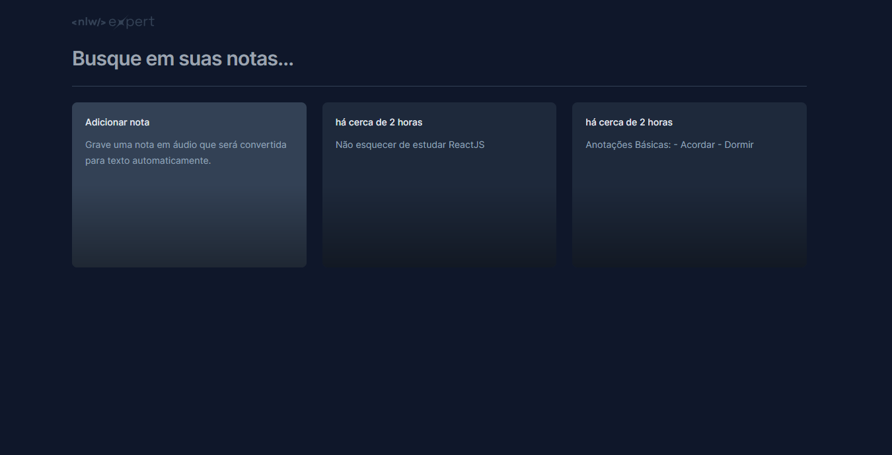
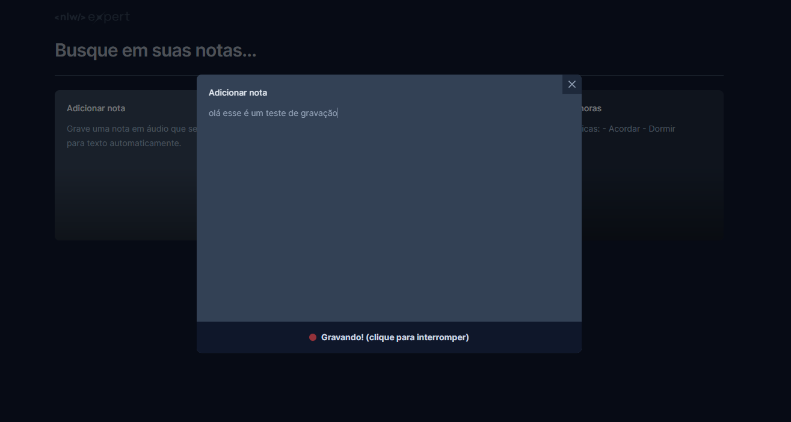

<h1 align="center">
  <br>
  <a href="https://app.rocketseat.com.br/home"></a>
  <br>
  NLW Expert Trilha React.js
  <br>
</h1>

<div align="center">
  
  
</div>

## Sobre

Expert Notes é uma aplicação desenvolvida durante o NLW Experts da Rocketseat, 
que permite aos usuários criar e gerenciar notas/lembretes de maneira eficiente. 
Foi construída com React, TypeScript, Tailwind CSS, e a SpeechRecognition API.

## Funcionalidades Principais

- Criação e remoção de notas.
- Opção de criação de notas por texto ou áudio, com transcrição automática de áudio para texto.
- Design responsivo para compatibilidade com diversos dispositivos.
- Notas são salvas localmente no navegador.

## Como usar 

Certifique que tenha instalado em sua máquina o [Git](https://git-scm.com) e [Node.js](https://nodejs.org/en/download/)

```bash
# Clone este repositório
git clone https://github.com/ryanpanta/expert-notes.git
````

Após clonar o repositório, acesse a pasta do projeto e execute os comandos abaixo:

```
npm install
npm run dev
```

Feito, acesse http://localhost:5173 para visualizar a aplicação.

## Licença
Este projeto está licenciado sob a Licença MIT - consulte o arquivo [LICENSE](https://github.com/ryanpanta/expert-notes/blob/main/LICENSE) para obter detalhes.


